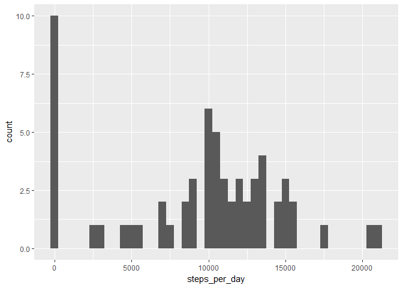
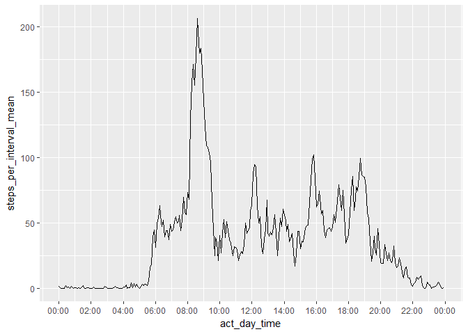
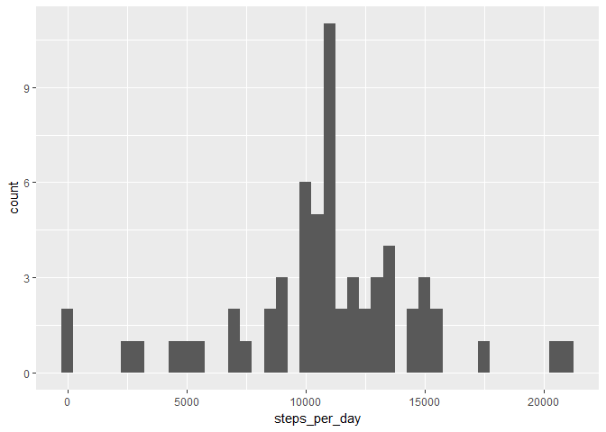
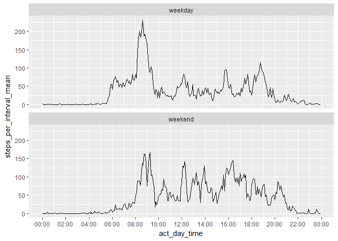

### Introduction

This is the output of the peer-graded assignment of project 1 within the modul "Reproducible Research" of the course "Data Science" of Johns Hopkins University.

It is now possible to collect a large amount of data about personal movement using activity monitoring devices such as a Fitbit, Nike Fuelband, or Jawbone Up. These type of devices are part of the "quantified self" movement - a group of enthusiasts who take measurements about themselves regularly to improve their health, to find patterns in their behavior, or because they are tech geeks. But these data remain under-utilized both because the raw data are hard to obtain and there is a lack of statistical methods and software for processing and interpreting the data.

This assignment makes use of data from a personal activity monitoring device. This device collects data at 5 minute intervals through out the day. The data consists of two months of data from an anonymous individual collected during the months of October and November, 2012 and include the number of steps taken in 5 minute intervals each day.

### Table of contents
There are 8 questions to be answered with the analysis.

1. Code for reading in the dataset and/or processing the data  
2. Histogram of the total number of steps taken each day  
3. Mean and median number of steps taken each day  
4. Time series plot of the average number of steps taken  
5. The 5-minute interval that, on average, contains the maximum number of steps  
6. Code to describe and show a strategy for imputing missing data  
7. Histogram of the total number of steps taken each day after missing values are imputed  
8. Panel plot comparing the average number of steps taken per 5-minute interval across weekdays and weekends  

### 1. Code for reading in the dataset and/or processing the data
I make use of the tidyverse and scales packages and downloaded the data from the give URL. Then I unzip it and read it in from my working directory. First, I explore the distinct values of "date" and "interval". The 5-minute interval isn't very informative. So, I convert the "date" and "interval" to an actual datetime and save the time in a separate column. What I really want is only the time portion of the datetime. But R doesn't seem to support this data type - it has to be datetime. The only way to aggregate by time alone I found, is to abitrarly choose a date and use it for all datetimes. I also extract the hour and minute as a time string.

```r
library(tidyverse)
```

```
## -- Attaching packages --------------------------------------------------------------------- tidyverse 1.2.0 --
```

```
## v ggplot2 2.2.1     v purrr   0.2.4
## v tibble  1.3.4     v dplyr   0.7.4
## v tidyr   0.7.2     v stringr 1.2.0
## v readr   1.1.1     v forcats 0.2.0
```

```
## -- Conflicts ------------------------------------------------------------------------ tidyverse_conflicts() --
## x dplyr::filter() masks stats::filter()
## x dplyr::lag()    masks stats::lag()
```

```r
library(scales)
```

```
## 
## Attaching package: 'scales'
```

```
## The following object is masked from 'package:purrr':
## 
##     discard
```

```
## The following object is masked from 'package:readr':
## 
##     col_factor
```

```r
setwd("D:/Studium/DataScience/Course Material/DataScience/05 Reproducible Research")
temp <- tempfile()
download.file("https://d396qusza40orc.cloudfront.net/repdata%2Fdata%2Factivity.zip", temp, mode="wb")
unzip(temp)
unlink(temp)
(act <- as_tibble(read.csv("activity.csv", na.strings = "NA")))
```

```
## # A tibble: 17,568 x 3
##    steps       date interval
##    <int>     <fctr>    <int>
##  1    NA 2012-10-01        0
##  2    NA 2012-10-01        5
##  3    NA 2012-10-01       10
##  4    NA 2012-10-01       15
##  5    NA 2012-10-01       20
##  6    NA 2012-10-01       25
##  7    NA 2012-10-01       30
##  8    NA 2012-10-01       35
##  9    NA 2012-10-01       40
## 10    NA 2012-10-01       45
## # ... with 17,558 more rows
```

```r
str(distinct(act, date)) # 61 daily dates, starting at 2012-10-01
```

```
## Classes 'tbl_df', 'tbl' and 'data.frame':	61 obs. of  1 variable:
##  $ date: Factor w/ 61 levels "2012-10-01","2012-10-02",..: 1 2 3 4 5 6 7 8 9 10 ...
```

```r
str(distinct(act, interval)) # 288 5-minutes intervals 
```

```
## Classes 'tbl_df', 'tbl' and 'data.frame':	288 obs. of  1 variable:
##  $ interval: int  0 5 10 15 20 25 30 35 40 45 ...
```

```r
(act_time <- act %>%
  mutate(datetime = as.POSIXct(paste(date, paste(interval%/%100, interval%%100, sep = ":"))),
         act_day_time = as.POSIXct(paste(Sys.Date(), paste(interval%/%100, interval%%100, sep = ":"))),
         time_str = strftime(act_day_time, format = "%H:%M:%S")
  )
)
```

```
## # A tibble: 17,568 x 6
##    steps       date interval            datetime        act_day_time
##    <int>     <fctr>    <int>              <dttm>              <dttm>
##  1    NA 2012-10-01        0 2012-10-01 00:00:00 2017-11-29 00:00:00
##  2    NA 2012-10-01        5 2012-10-01 00:05:00 2017-11-29 00:05:00
##  3    NA 2012-10-01       10 2012-10-01 00:10:00 2017-11-29 00:10:00
##  4    NA 2012-10-01       15 2012-10-01 00:15:00 2017-11-29 00:15:00
##  5    NA 2012-10-01       20 2012-10-01 00:20:00 2017-11-29 00:20:00
##  6    NA 2012-10-01       25 2012-10-01 00:25:00 2017-11-29 00:25:00
##  7    NA 2012-10-01       30 2012-10-01 00:30:00 2017-11-29 00:30:00
##  8    NA 2012-10-01       35 2012-10-01 00:35:00 2017-11-29 00:35:00
##  9    NA 2012-10-01       40 2012-10-01 00:40:00 2017-11-29 00:40:00
## 10    NA 2012-10-01       45 2012-10-01 00:45:00 2017-11-29 00:45:00
## # ... with 17,558 more rows, and 1 more variables: time_str <chr>
```

### 2. Histogram of the total number of steps taken each day
I use the pipe notation and ggplot2 throughout this analysis. To get the total number of steps taken each day, I first have to group the data by "date" and then summarize it. I save this data set for further analysis. For the histogram I specify a binwidth of 500 steps.

```r
(steps_per_day <- act_time %>%
  group_by(date) %>%
  summarize(steps_per_day = sum(steps, na.rm = TRUE)))
```

```
## # A tibble: 61 x 2
##          date steps_per_day
##        <fctr>         <int>
##  1 2012-10-01             0
##  2 2012-10-02           126
##  3 2012-10-03         11352
##  4 2012-10-04         12116
##  5 2012-10-05         13294
##  6 2012-10-06         15420
##  7 2012-10-07         11015
##  8 2012-10-08             0
##  9 2012-10-09         12811
## 10 2012-10-10          9900
## # ... with 51 more rows
```

```r
steps_per_day %>%
  ggplot(mapping = aes(steps_per_day)) + geom_histogram(binwidth = 500)
```

<!-- -->

### 3. Mean and median number of steps taken each day
With the data set created at question 2 I can easily compute the mean and median of the total number of steps taken each day.

```r
steps_per_day %>%
  summarize(steps_per_day_mean = mean(steps_per_day, na.rm = TRUE),
            steps_per_day_median = median(steps_per_day, na.rm = TRUE))
```

```
## # A tibble: 1 x 2
##   steps_per_day_mean steps_per_day_median
##                <dbl>                <int>
## 1            9354.23                10395
```

### 4. Time series plot of the average number of steps taken
The time series plot should display the average number of steps taken at each interval of a day. For better readability, I converted the interval to times. Using the time string for the x-axis doesn't seem to work. I need to use a number format, so I display my "act_day_time", but define a format to only show the hours and minutes.

To get the right y-values, I first need to group the data by the x-values and then calculate the mean across all days. I safe the resulting data set for further analysis.

```r
(steps_per_interval <- act_time %>%
  group_by(act_day_time, time_str, interval) %>%
  summarize(steps_per_interval_mean = mean(steps, na.rm = TRUE)))
```

```
## # A tibble: 288 x 4
## # Groups:   act_day_time, time_str [?]
##           act_day_time time_str interval steps_per_interval_mean
##                 <dttm>    <chr>    <int>                   <dbl>
##  1 2017-11-29 00:00:00 00:00:00        0               1.7169811
##  2 2017-11-29 00:05:00 00:05:00        5               0.3396226
##  3 2017-11-29 00:10:00 00:10:00       10               0.1320755
##  4 2017-11-29 00:15:00 00:15:00       15               0.1509434
##  5 2017-11-29 00:20:00 00:20:00       20               0.0754717
##  6 2017-11-29 00:25:00 00:25:00       25               2.0943396
##  7 2017-11-29 00:30:00 00:30:00       30               0.5283019
##  8 2017-11-29 00:35:00 00:35:00       35               0.8679245
##  9 2017-11-29 00:40:00 00:40:00       40               0.0000000
## 10 2017-11-29 00:45:00 00:45:00       45               1.4716981
## # ... with 278 more rows
```

```r
# Generator function to create "hh:mm" labels for the x axis without explicit "tz" specification  
date_format <- function(format = "%H:%M") {
  function(x) format(x, format)
}
steps_per_interval %>%
  ggplot(mapping = aes(x = act_day_time, y = steps_per_interval_mean)) +
  geom_line() +
  scale_x_datetime(breaks = date_breaks("2 hours"), labels = date_format())
```

<!-- -->

### 5. The 5-minute interval that, on average, contains the maximum number of steps
With the data set created at question 4 I can easily filter the row(s) having the maximum value of all intevals. Note, that  I first have to ungroup the data set.

```r
steps_per_interval %>%
  ungroup() %>%
  filter(steps_per_interval_mean == max(steps_per_interval_mean))
```

```
## # A tibble: 1 x 4
##          act_day_time time_str interval steps_per_interval_mean
##                <dttm>    <chr>    <int>                   <dbl>
## 1 2017-11-29 08:35:00 08:35:00      835                206.1698
```

### 6. Code to describe and show a strategy for imputing missing data
I first show the count of missing values in each column of the original data. Only the column "steps" has missing values. To imputate the missing values I basically have to options (I don't mention more sophiticated ones): I can imputate with the mean/median per day or per interval. I choose to imputate with the median per interval, as this should be the most reliable method. Median is more robust than mean and the number of steps probable differs more within days than within intervals.

So, I first have to group the data by "interval"" and than conditionally recalculate "steps": If steps is missing I take the median across all days within the given interval. Note, that I have to ungroup the data at the end. I save the resulting data set for further analysis.

```r
act_time %>% summarise_each(funs(sum(is.na(.))))
```

```
## `summarise_each()` is deprecated.
## Use `summarise_all()`, `summarise_at()` or `summarise_if()` instead.
## To map `funs` over all variables, use `summarise_all()`
```

```
## # A tibble: 1 x 6
##   steps  date interval datetime act_day_time time_str
##   <int> <int>    <int>    <int>        <int>    <int>
## 1  2304     0        0        0            0        0
```

```r
# impute missing steps with median of the same interval
act_clean <- act_time %>%
  group_by(interval) %>%
  mutate(steps = ifelse(is.na(steps), mean(steps, na.rm = TRUE), steps)) %>%
  ungroup()
```

### 7. Histogram of the total number of steps taken each day after missing values are imputed
I repeat the work of questions 2 and 3 with the imputated data set. The results differ considerably and point out that missing values always have to be treated with care! Especially the first bin (0 - 500 steps) had many more observations in the original data. With all the missing values, the sum per day was smaller than it is with the imputated values. It looks like there's a pattern: There could be many days that have about 11000 steps missing compared to a standard day. With the imputated data the bin of 11000 - 11500 steps seems to have taken over most of the observations that were in the bin of 0 - 500 steps with the original data.

```r
(steps_per_day_clean <- act_clean %>%
  group_by(date) %>%
  summarize(steps_per_day = sum(steps, na.rm = TRUE)))
```

```
## # A tibble: 61 x 2
##          date steps_per_day
##        <fctr>         <dbl>
##  1 2012-10-01      10766.19
##  2 2012-10-02        126.00
##  3 2012-10-03      11352.00
##  4 2012-10-04      12116.00
##  5 2012-10-05      13294.00
##  6 2012-10-06      15420.00
##  7 2012-10-07      11015.00
##  8 2012-10-08      10766.19
##  9 2012-10-09      12811.00
## 10 2012-10-10       9900.00
## # ... with 51 more rows
```

```r
steps_per_day_clean %>%
  ggplot(mapping = aes(steps_per_day)) + geom_histogram(binwidth = 500)
```

<!-- -->

```r
steps_per_day_clean %>%
  summarize(steps_per_day_mean = mean(steps_per_day, na.rm = TRUE),
            steps_per_day_median = median(steps_per_day, na.rm = TRUE))
```

```
## # A tibble: 1 x 2
##   steps_per_day_mean steps_per_day_median
##                <dbl>                <dbl>
## 1           10766.19             10766.19
```

### 8. Panel plot comparing the average number of steps taken per 5-minute interval across weekdays and weekends
First, I need to get the weekday of each date. This can be done with weekdays(), which returns the full name of the weekday. The next step is to compare the returned strings with the ones for the weekend c("Saturday", "Sunday"). The problem with this approach is that the names are returned in the current system locale. So, you need to make sure to set the locale to one that actually returns english names.

The pattern for weekdays and weekends differ clearly. As people get up later on weekends, the number of steps stay low for a longer time. Apart from the morning rush hour, people take more steps in the on weekends than on weekdays (you don't need to sit at your desk all the time) and tend to be active longer into the night (mostly on Saturdays, I assume).

```r
Sys.getlocale(category = "LC_TIME")
```

```
## [1] "German_Switzerland.1252"
```

```r
# set locale to standard to get english weekday names
Sys.setlocale("LC_TIME", "C")
```

```
## [1] "C"
```

```r
act_clean_wd <- act_clean %>%
  mutate(
    weekday = weekdays(as.Date(date)),
    weekend = factor(ifelse(weekday %in% c("Saturday", "Sunday"), "weekend", "weekday"))
  )
distinct(act_clean_wd, weekday, weekend)
```

```
## # A tibble: 7 x 2
##     weekday weekend
##       <chr>  <fctr>
## 1    Monday weekday
## 2   Tuesday weekday
## 3 Wednesday weekday
## 4  Thursday weekday
## 5    Friday weekday
## 6  Saturday weekend
## 7    Sunday weekend
```

```r
act_clean_wd %>%
  group_by(weekend, act_day_time) %>%
  summarize(steps_per_interval_mean = mean(steps, na.rm = TRUE)) %>%
  ggplot(mapping = aes(x = act_day_time, y = steps_per_interval_mean)) +
  geom_line() +
  scale_x_datetime(breaks = date_breaks("2 hours"), labels = date_format()) +
  facet_wrap(~ weekend, nrow = 2)
```

<!-- -->
